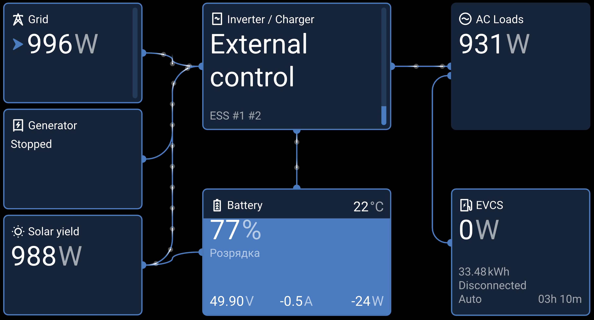
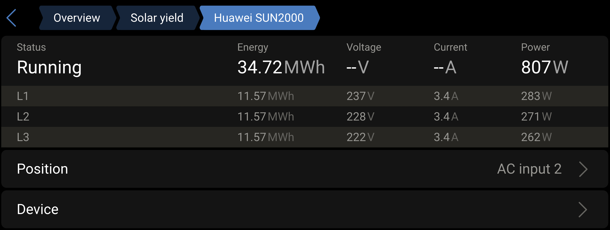
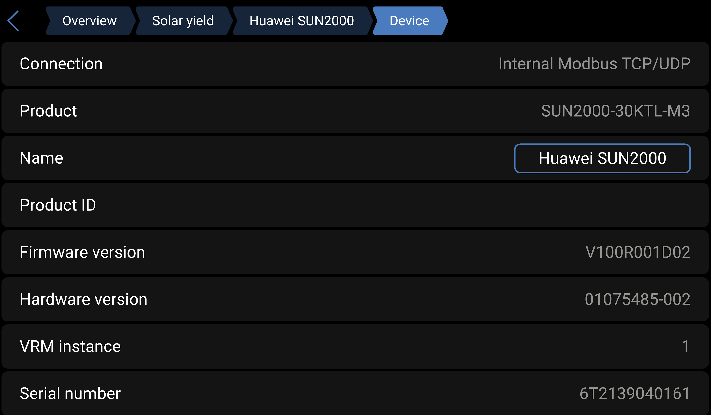
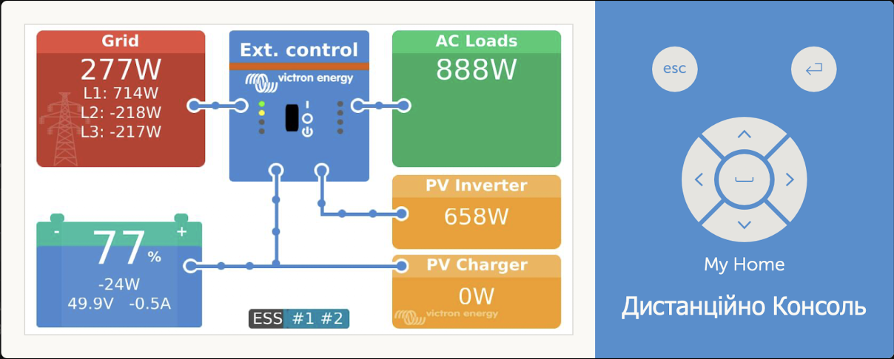
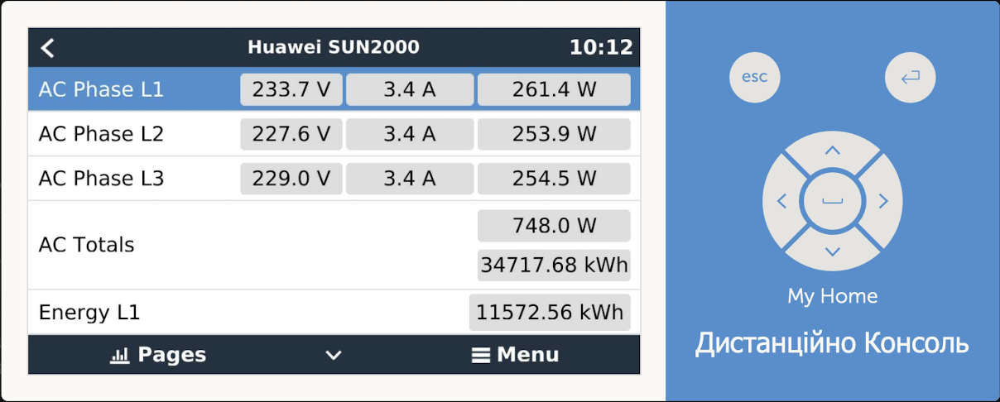
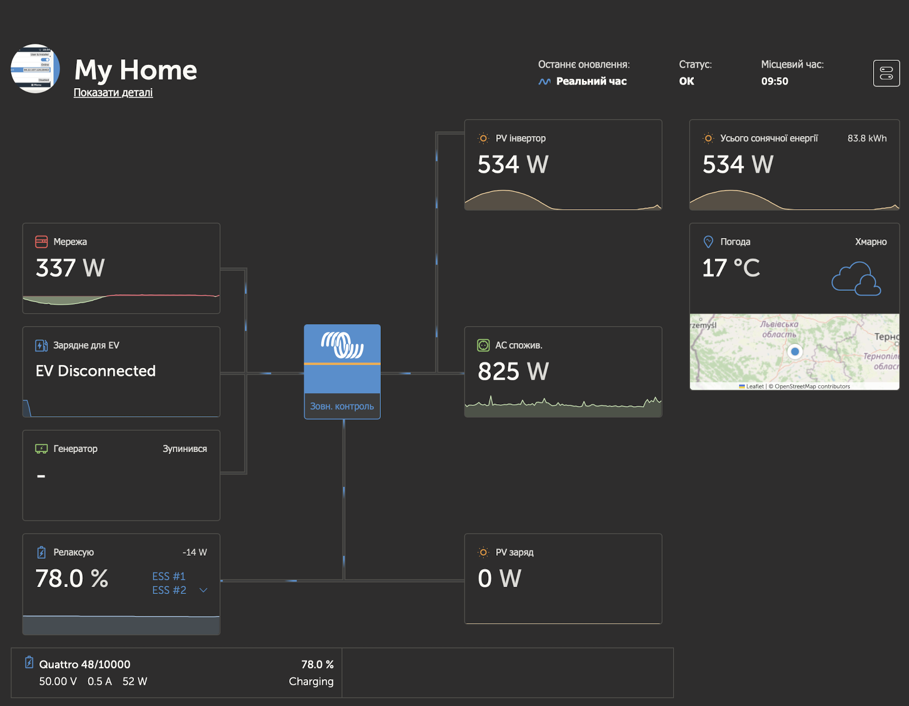
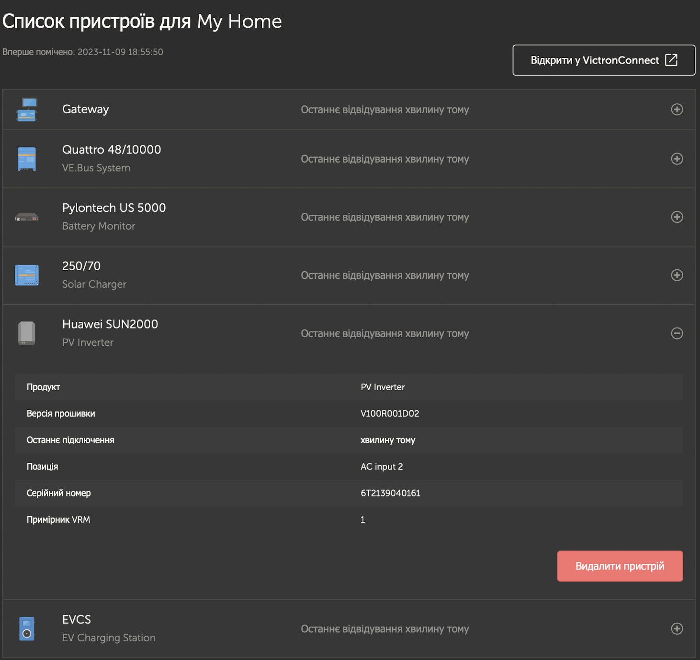

# dbus-huaweisun2000-pvinverter

[](LICENSE)
[](https://github.com/taras-kolodchyn/dbus-huaweisun2000-pvinverter/releases)
-informational)
[](https://www.python.org/downloads/release/python-3129/)
[](https://github.com/taras-kolodchyn/dbus-huaweisun2000-pvinverter/actions/workflows/python-ci.yml)


> **A D-Bus driver for seamless integration of Huawei SUN2000 inverters into Victron Cerbo GX / Venus OS**

---

## 🚀 Overview

`dbus-huaweisun2000-pvinverter` brings live data from Huawei SUN2000 PV inverters directly into your Victron Venus OS (Cerbo GX) and VRM Portal — no additional hardware required.  
Get detailed monitoring, energy analytics, and remote diagnostics — all in one open-source, easy-to-install package.

---

## ⚡ Features

- **Live monitoring:** All key metrics from your Huawei inverter in Venus OS & VRM.
- **Zero hardware hacks:** Works over Modbus TCP (WiFi/LAN).
- **Easy integration:** Clean D-Bus API for use with Victron native apps.
- **Simple install/update/uninstall scripts.**
- **Auto reconnection & robust error handling.**
- **Fully open source — contribute and extend!**

---

## 📦 Requirements

- **Victron Cerbo GX** or compatible device with Venus OS (**v3.60 – v3.65** verified)
- **Huawei SUN2000 inverter** (any recent model)
- **Inverter WiFi or LAN access** (Modbus TCP port 502 open)
- **Python 3.x** (pre-installed on Venus OS)

> ⚠️ **Venus OS firmware below v3.60 is not supported!**

---

## 🧪 Tested Devices & Compatibility

| Device           | Version                       | Status         |
|------------------|-------------------------------|----------------|
| Cerbo GX         | Venus OS v3.60 – v3.65        | Supported      |
| SUN2000-30KTL-M3 | Latest firmware               | Supported      |

- Venus OS versions 3.60–3.65 have been verified as working.
- Other recent Huawei SUN2000 inverters should work if they support Modbus TCP.
- See [Issues](https://github.com/taras-kolodchyn/dbus-huaweisun2000-pvinverter/issues) for compatibility reports.

---

## 📥 Installation

### 1. Download and deploy

**From GitHub Releases (recommended for stable):**

```bash
cd /data
wget https://github.com/taras-kolodchyn/dbus-huaweisun2000-pvinverter/releases/download/v1.0.0/dbus-huaweisun2000-pvinverter-v1.0.0.zip
unzip dbus-huaweisun2000-pvinverter-v1.0.0.zip
cd dbus-huaweisun2000-pvinverter
chmod +x install.sh
sh install.sh
```

**Or clone the latest main branch (for advanced users):**

```bash
scp -r dbus-huaweisun2000-pvinverter root@venus:/data/
# or
cd /data
wget https://github.com/taras-kolodchyn/dbus-huaweisun2000-pvinverter/archive/refs/heads/main.zip
unzip main.zip
mv dbus-huaweisun2000-pvinverter-main dbus-huaweisun2000-pvinverter
chmod +x dbus-huaweisun2000-pvinverter/install.sh
sh dbus-huaweisun2000-pvinverter/install.sh
```

---

## ▶️ Usage

- Service autostarts after installation.
- **Check status:** `svstat /service/dbus-huaweisun2000-pvinverter`
- **Manual debug:**  
  `python /data/dbus-huaweisun2000-pvinverter/dbus-huaweisun2000-pvinverter.py`
- **Logs:**  
  `tail -f /var/log/dbus-huaweisun2000/current | tai64nlocal`

## ⚠️ New UI Settings Notice

As of Venus OS v3.60–v3.65, the **New UI (GUI‑v2)** does not display the full settings menu for third‑party PV inverter drivers.  
If you need to change the inverter’s Modbus host, port, unit, or position:

- **Use the Classic UI**:  
  Go to *Menu → Settings → PV Inverters → Huawei SUN2000*

- **Or change values directly via D‑Bus** (Remote Console → `dbus-spy`):  
  1. Open `com.victronenergy.pvinverter.sun2000`  
  2. Edit `/Position` (0 = AC Input, 1 = AC‑Out 1, 2 = AC‑Out 2)  
  3. Update Modbus settings under `com.victronenergy.settings`

Once Victron adds support for custom settings pages in the New UI, these options will appear directly there.

---

## 🔄 Updating

```bash
sh /data/dbus-huaweisun2000-pvinverter/restart.sh
```

---

## 🗑️ Uninstall

```bash
sh /data/dbus-huaweisun2000-pvinverter/uninstall.sh
rm -r /data/dbus-huaweisun2000-pvinverter/
```

---

## 📸 Screenshots

### New UI (Venus OS)

  
  
  

### Classic UI

  
  

### VRM Portal

  
  

---

## 💡 Troubleshooting

- **No data in VRM?**  
  Check Modbus settings (IP, port 502, unit ID), network, and logs.
- **Service restarts?**  
  Run main script manually and watch logs for errors.
- **General logs:**  
  `tail -f /var/log/dbus-huaweisun2000/current | tai64nlocal`
- See [GitHub Issues](https://github.com/taras-kolodchyn/dbus-huaweisun2000-pvinverter/issues) or [Discussions](https://github.com/taras-kolodchyn/dbus-huaweisun2000-pvinverter/discussions).

---

## 📝 License

MIT License. See [LICENSE](LICENSE).

---

## ☕ Support

If you find this project useful and want to support its development, you can help in the following ways:

- **Star the repository** ⭐ — It helps others discover the project.  
- **Report bugs or request features** via [GitHub Issues](../../issues).  
- **Join discussions** in the [GitHub Discussions](../../discussions).  
- **Contribute code** — See the [Contributing](#-contributing) section.  

---

### 💖 Direct Support

[](https://buymeacoffee.com/taras.kolodchyn)
[](https://www.privat24.ua/send/h21hq)

## 🤝 Contributing

- Pull requests are welcome!
- Please read [CONTRIBUTING.md](CONTRIBUTING.md) (to be added).
- All feedback, issues, and PRs appreciated.

---

## 🌍 Community

- [Discussions](https://github.com/taras-kolodchyn/dbus-huaweisun2000-pvinverter/discussions)
- [Report an Issue](https://github.com/taras-kolodchyn/dbus-huaweisun2000-pvinverter/issues)

---