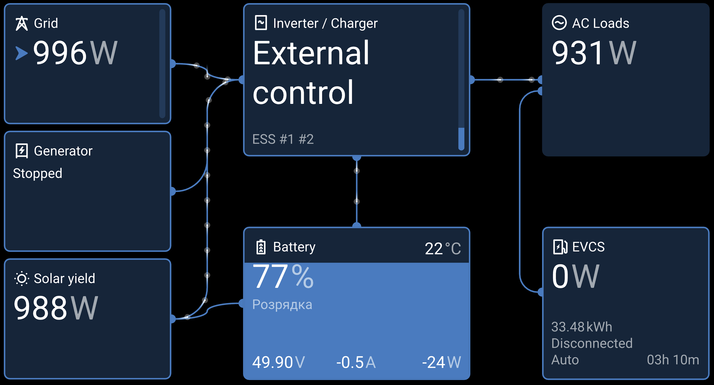
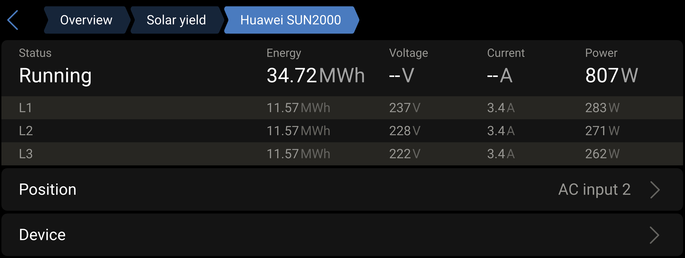
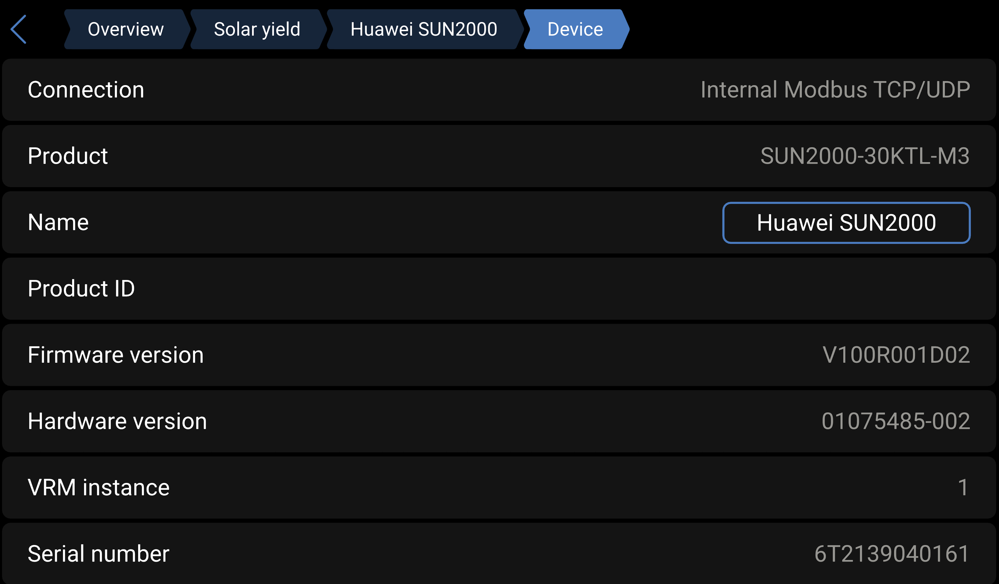
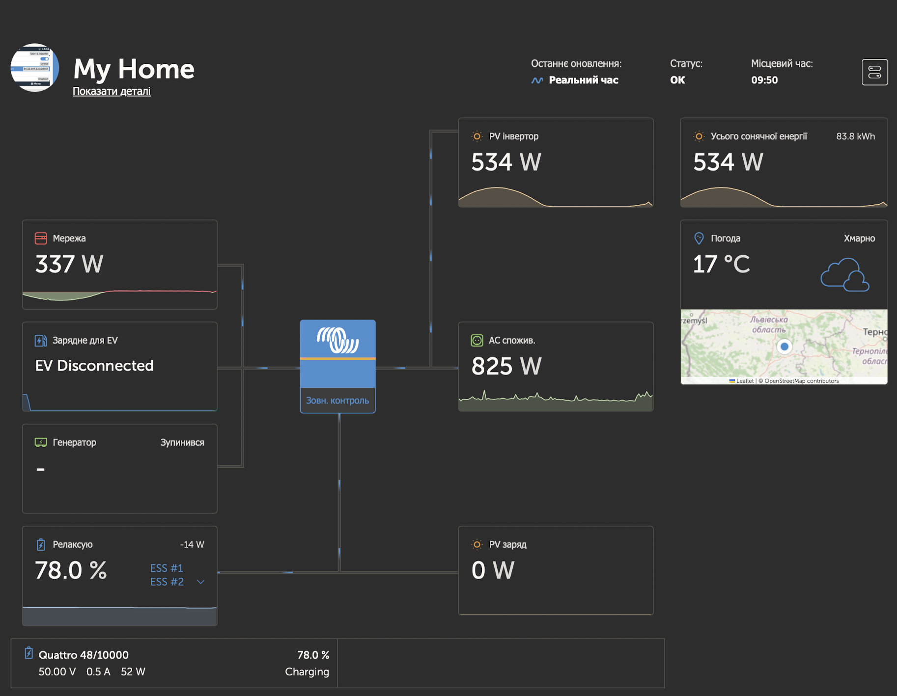
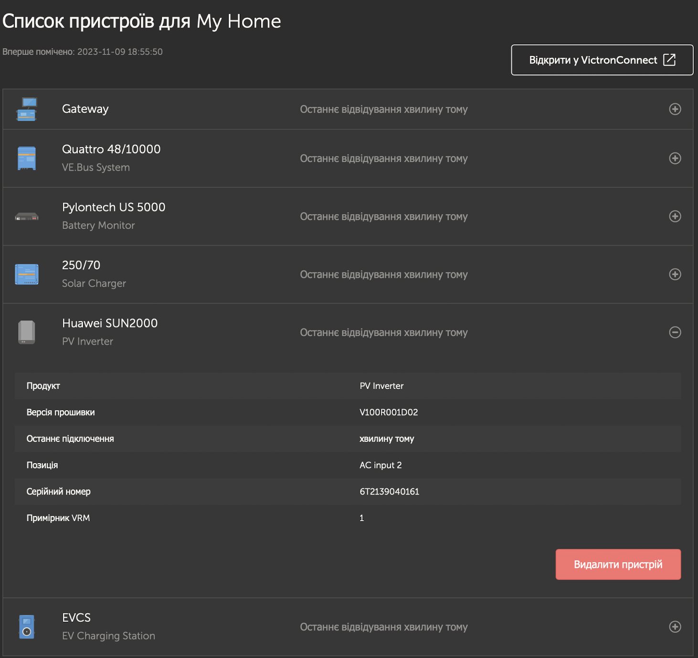

# dbus-huaweisun2000-pvinverter

[](LICENSE)
[](https://github.com/taras-kolodchyn/dbus-huaweisun2000-pvinverter/releases)
-informational)
[](https://www.python.org/downloads/release/python-3120/)
[](https://github.com/taras-kolodchyn/dbus-huaweisun2000-pvinverter/actions/workflows/python-ci.yml)


> **A D-Bus driver for seamless integration of Huawei SUN2000 inverters into Victron Cerbo GX / Venus OS**

---

## Overview

`dbus-huaweisun2000-pvinverter` brings live data from Huawei SUN2000 PV inverters directly into your Victron Venus OS (Cerbo GX) and VRM Portal without additional hardware.

The driver reads inverter data over Modbus TCP, publishes it on D-Bus as a `pvinverter`, and makes it available to Venus OS and VRM.

---

## Features

- Live monitoring of key Huawei inverter metrics in Venus OS and VRM
- Modbus TCP integration over WiFi or LAN
- Clean D-Bus service for native Victron consumers
- Install, restart, configure, and uninstall scripts
- Auto reconnect, range batching, and adaptive polling
- Containerized smoke and integration tests

---

## Requirements

- Victron Cerbo GX or another Venus OS device
- Venus OS (**v3.71+**)
- Huawei SUN2000 inverter with Modbus TCP access
- Python 3.12 runtime on the target Venus OS image
- TCP port `502` reachable from the GX device to the inverter

> Venus OS firmware below v3.71 is not supported. Older releases ship an earlier Python runtime and will not run this version of the driver.

---

## Tested Compatibility

| Device | Version | Status |
| --- | --- | --- |
| Cerbo GX | Venus OS `v3.71` and newer | Supported |
| SUN2000-30KTL-M3 | Latest firmware | Supported |

- Venus OS versions before `v3.71` are not supported by the current Python 3.12 baseline.
- Other recent Huawei SUN2000 inverters should work if they support Modbus TCP.
- See [Issues](https://github.com/taras-kolodchyn/dbus-huaweisun2000-pvinverter/issues) for compatibility reports.

---

## Installation

### Download and deploy

Recommended for stable installs:

```bash
cd /data
wget https://github.com/taras-kolodchyn/dbus-huaweisun2000-pvinverter/releases/latest/download/dbus-huaweisun2000-pvinverter.zip -O dbus-huaweisun2000-pvinverter.zip || \
  wget https://github.com/taras-kolodchyn/dbus-huaweisun2000-pvinverter/releases/download/v1.1.0/dbus-huaweisun2000-pvinverter-v1.1.0.zip -O dbus-huaweisun2000-pvinverter.zip
unzip dbus-huaweisun2000-pvinverter.zip -d dbus-huaweisun2000-pvinverter
cd dbus-huaweisun2000-pvinverter
chmod +x install.sh
sh install.sh
```

Or copy/clone the repository manually:

```bash
scp -r dbus-huaweisun2000-pvinverter root@venus:/data/
```

Or download `main` directly on the device:

```bash
cd /data
wget https://github.com/taras-kolodchyn/dbus-huaweisun2000-pvinverter/archive/refs/heads/main.zip
unzip main.zip -d dbus-huaweisun2000-pvinverter
mv dbus-huaweisun2000-pvinverter-main dbus-huaweisun2000-pvinverter
chmod +x dbus-huaweisun2000-pvinverter/install.sh
sh dbus-huaweisun2000-pvinverter/install.sh
```

---

## Usage

- The service autostarts after installation.
- Fresh installs stay idle until you replace the default host `255.255.255.255` with a real inverter IP.
- Check service status with `svstat /service/dbus-huaweisun2000-pvinverter`.
- Run a manual debug session with:

```bash
PYTHONPATH=/data/dbus-huaweisun2000-pvinverter/src python -m dbus_huaweisun2000_pvinverter
```

- Watch logs with:

```bash
tail -f /var/log/dbus-huaweisun2000/current | tai64nlocal
```

---

## Configuration

This project now targets **GUI-v2 only**.

Configure the driver directly on Venus OS:

```bash
sh /data/dbus-huaweisun2000-pvinverter/configure.sh --host 192.168.211.50 --port 502 --unit 3
sh /data/dbus-huaweisun2000-pvinverter/configure.sh --position 2 --custom-name "Huawei SUN2000"
sh /data/dbus-huaweisun2000-pvinverter/configure.sh --vrm-instance 20
sh /data/dbus-huaweisun2000-pvinverter/configure.sh --show
```

- The script writes settings under `com.victronenergy.settings`, so changes survive restarts.
- If you prefer manual editing, use Remote Console with `dbus-spy` and update `/Settings/HuaweiSUN2000/*`.
- Runtime log level can be overridden with `DBUS_HUAWEISUN2000_LOGLEVEL`.
- Dev-mode Modbus overrides are available via `DBUS_HUAWEISUN2000_MODBUS_HOST`, `DBUS_HUAWEISUN2000_MODBUS_PORT`, and `DBUS_HUAWEISUN2000_MODBUS_UNIT`.
- Runtime defaults are host `255.255.255.255`, port `502`, and unit `0`.
- If your inverter model naming is unusual, set `DBUS_HUAWEISUN2000_PHASE_TYPE` to `single-phase` or `three-phase` to override auto detection.

---

## Updating

```bash
sh /data/dbus-huaweisun2000-pvinverter/restart.sh
```

---

## Uninstall

```bash
sh /data/dbus-huaweisun2000-pvinverter/uninstall.sh
rm -r /data/dbus-huaweisun2000-pvinverter/
```

---

## Screenshots

### New UI





### VRM Portal




---

## Troubleshooting

- No data in VRM: verify Modbus host, port `502`, unit ID, and network reachability from the GX device.
- Service restarts: run the module manually and inspect `tail -f /var/log/dbus-huaweisun2000/current | tai64nlocal`.
- Browser Remote Console and VRM can still differ from local GX `gui-v2` behavior because the browser UI is rendered from the upstream compiled web app.
- See [Issues](https://github.com/taras-kolodchyn/dbus-huaweisun2000-pvinverter/issues) and [Discussions](https://github.com/taras-kolodchyn/dbus-huaweisun2000-pvinverter/discussions) for known hardware-specific cases.

---

## Development

### Project layout

- `src/dbus_huaweisun2000_pvinverter/` - packaged Python source
- `tests/` - self-contained unit tests with lightweight stubs
- `service/` - run scripts used by the Venus OS init system
- `img/` - screenshots bundled with releases

### Local workflow

1. Install tooling and dependencies:

   ```bash
   python3.12 -m pip install --upgrade pip
   python3.12 -m pip install '.[dev]'
   ```

2. Run quality checks locally:

   ```bash
   black --check .
   flake8 .
   pytest --maxfail=1 --disable-warnings -q
   bash docker/test_install_uninstall.sh
   ```

3. Reproduce the GitHub Actions pipeline with [act](https://github.com/nektos/act):

   ```bash
   act -j ci
   # On Apple silicon you may need:
   act -j ci --container-architecture linux/amd64
   ```

4. See [CONTRIBUTING.md](CONTRIBUTING.md) for additional guidelines.

### Docker playground

Launch the simulator stack with:

```bash
docker compose -f docker-compose.dev.yml up --build
```

Run the heavier install/runtime/uninstall integration check with:

```bash
docker compose -f docker-compose.dev.yml -f docker-compose.install-test.yml up --build --abort-on-container-exit
docker compose -f docker-compose.dev.yml -f docker-compose.install-test.yml down --volumes --remove-orphans
```

The playground pins the simulator to Modbus unit `1` explicitly, while the real driver default remains `0` until configured.

---

## License

MIT License. See [LICENSE](LICENSE).

---

## Support

If this project helps you, you can support it by starring the repository, opening issues, joining discussions, or contributing code.

[](https://buymeacoffee.com/taras.kolodchyn)
[](https://www.privat24.ua/send/h21hq)

---

## Contributing

- Pull requests are welcome.
- Please read [CONTRIBUTING.md](CONTRIBUTING.md).
- Feedback, issues, and PRs are appreciated.

---

## Community

- [Discussions](https://github.com/taras-kolodchyn/dbus-huaweisun2000-pvinverter/discussions)
- [Report an Issue](https://github.com/taras-kolodchyn/dbus-huaweisun2000-pvinverter/issues)
